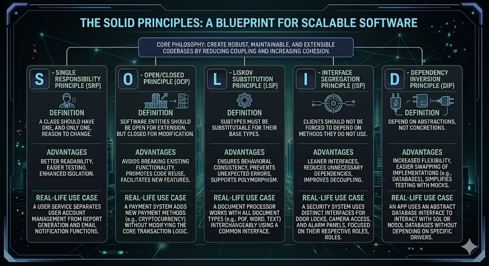

# SOLID Principles



## Overview

SOLID is an acronym for five design principles intended to make software designs more understandable, flexible, and maintainable. These principles were introduced by Robert C. Martin (Uncle Bob) and are fundamental to object-oriented design.

---

## 1. Single Responsibility Principle (SRP)

**Definition:** A class or module should have one, and only one, reason to change. It should have a single responsibility.

### Real-Life Example: Email Notification System

**❌ Bad Implementation:**
```cpp
#include <iostream>
#include <string>

class User {
private:
    std::string name;
    std::string email;

public:
    User(const std::string& n, const std::string& e) 
        : name(n), email(e) {}

    void saveToDB() {
        // Database logic
        std::cout << "Saving " << name << " to database" << std::endl;
    }

    void sendEmail() {
        // Email sending logic
        std::cout << "Sending email to " << email << std::endl;
    }

    void generateReport() {
        // Report generation logic
        std::cout << "Generating report for " << name << std::endl;
    }
};
```

The `User` class has three responsibilities: database persistence, email sending, and report generation.

**✅ Good Implementation:**
```cpp
#include <iostream>
#include <string>

class User {
private:
    std::string name;
    std::string email;

public:
    User(const std::string& n, const std::string& e) 
        : name(n), email(e) {}

    std::string getName() const { return name; }
    std::string getEmail() const { return email; }
};

class UserRepository {
public:
    void save(const User& user) {
        std::cout << "Saving " << user.getName() << " to database" << std::endl;
    }
};

class EmailService {
public:
    void send(const User& user) {
        std::cout << "Sending email to " << user.getEmail() << std::endl;
    }
};

class ReportGenerator {
public:
    void generate(const User& user) {
        std::cout << "Generating report for " << user.getName() << std::endl;
    }
};
```

**Benefits:**
- Easier to test each class independently
- Changes to email logic don't affect user data logic
- Better code reusability

---

## 2. Open/Closed Principle (OCP)

**Definition:** Software entities (classes, modules, functions) should be open for extension but closed for modification.

### Real-Life Example: Payment Processing System

**❌ Bad Implementation:**
```cpp
#include <iostream>
#include <string>

class PaymentProcessor {
public:
    void processPayment(const std::string& paymentType, double amount) {
        if (paymentType == "credit_card") {
            std::cout << "Processing credit card payment of $" << amount << std::endl;
        } 
        else if (paymentType == "paypal") {
            std::cout << "Processing PayPal payment of $" << amount << std::endl;
        } 
        else if (paymentType == "bitcoin") {
            std::cout << "Processing Bitcoin payment of $" << amount << std::endl;
        }
        // Every new payment method requires modifying this class
    }
};
```

**✅ Good Implementation:**
```cpp
#include <iostream>
#include <memory>

class PaymentMethod {
public:
    virtual ~PaymentMethod() = default;
    virtual void process(double amount) = 0;
};

class CreditCardPayment : public PaymentMethod {
public:
    void process(double amount) override {
        std::cout << "Processing credit card payment of $" << amount << std::endl;
    }
};

class PayPalPayment : public PaymentMethod {
public:
    void process(double amount) override {
        std::cout << "Processing PayPal payment of $" << amount << std::endl;
    }
};

class BitcoinPayment : public PaymentMethod {
public:
    void process(double amount) override {
        std::cout << "Processing Bitcoin payment of $" << amount << std::endl;
    }
};

class PaymentProcessor {
public:
    void processPayment(std::unique_ptr<PaymentMethod> paymentMethod, double amount) {
        paymentMethod->process(amount);
    }
};

// Usage
int main() {
    PaymentProcessor processor;
    processor.processPayment(std::make_unique<CreditCardPayment>(), 100.0);
    processor.processPayment(std::make_unique<PayPalPayment>(), 50.0);
    processor.processPayment(std::make_unique<BitcoinPayment>(), 75.0);
    return 0;
}
```

**Benefits:**
- New payment methods can be added without modifying existing code
- Reduces the risk of breaking existing functionality
- Easier to maintain and extend

---

## 3. Liskov Substitution Principle (LSP)

**Definition:** Objects of a superclass should be replaceable with objects of its subclasses without breaking the application.

### Real-Life Example: Bird Classification

**❌ Bad Implementation:**
```cpp
#include <iostream>
#include <stdexcept>

class Bird {
public:
    virtual ~Bird() = default;
    virtual void fly() = 0;
};

class Eagle : public Bird {
public:
    void fly() override {
        std::cout << "Eagle is flying at high altitude" << std::endl;
    }
};

class Penguin : public Bird {
public:
    void fly() override {
        throw std::runtime_error("Penguins cannot fly!");  // Violates LSP
    }
};
```

**✅ Good Implementation:**
```cpp
#include <iostream>

class Bird {
public:
    virtual ~Bird() = default;
    virtual void move() = 0;
};

class FlyingBird : public Bird {
public:
    virtual void fly() = 0;
};

class SwimmingBird : public Bird {
public:
    virtual void swim() = 0;
};

class Eagle : public FlyingBird {
public:
    void move() override {
        fly();
    }

    void fly() override {
        std::cout << "Eagle is flying at high altitude" << std::endl;
    }
};

class Penguin : public SwimmingBird {
public:
    void move() override {
        swim();
    }

    void swim() override {
        std::cout << "Penguin is swimming underwater" << std::endl;
    }
};

// Usage
int main() {
    Eagle eagle;
    eagle.fly();
    
    Penguin penguin;
    penguin.swim();
    
    return 0;
}
```

**Benefits:**
- Subclasses can be used interchangeably with their parent classes
- Prevents runtime errors and unexpected behavior
- Makes code more predictable and reliable

---

## 4. Interface Segregation Principle (ISP)

**Definition:** Clients should not be forced to depend on interfaces they don't use. It's better to have many specific interfaces than one general-purpose interface.

### Real-Life Example: Worker Interface

**❌ Bad Implementation:**
```cpp
#include <iostream>
#include <stdexcept>

class Worker {
public:
    virtual ~Worker() = default;
    virtual void work() = 0;
    virtual void eatLunch() = 0;
};

class Robot : public Worker {
public:
    void work() override {
        std::cout << "Robot is working" << std::endl;
    }

    void eatLunch() override {
        throw std::runtime_error("Robots don't eat!");  // Unnecessary method
    }
};
```

**✅ Good Implementation:**
```cpp
#include <iostream>

class Workable {
public:
    virtual ~Workable() = default;
    virtual void work() = 0;
};

class Eatable {
public:
    virtual ~Eatable() = default;
    virtual void eatLunch() = 0;
};

class Human : public Workable, public Eatable {
public:
    void work() override {
        std::cout << "Human is working" << std::endl;
    }

    void eatLunch() override {
        std::cout << "Human is eating lunch" << std::endl;
    }
};

class Robot : public Workable {
public:
    void work() override {
        std::cout << "Robot is working" << std::endl;
    }
};

// Usage
int main() {
    Human human;
    human.work();
    human.eatLunch();
    
    Robot robot;
    robot.work();
    // robot.eatLunch(); // Not available - correct!
    
    return 0;
}
```

**Benefits:**
- Classes only implement methods they actually need
- Reduces coupling between classes
- Improves code clarity and flexibility

---

## 5. Dependency Inversion Principle (DIP)

**Definition:** High-level modules should not depend on low-level modules. Both should depend on abstractions. Abstractions should not depend on details. Details should depend on abstractions.

### Real-Life Example: Database Connection

**❌ Bad Implementation:**
```cpp
#include <iostream>
#include <string>

class MySQLDatabase {
public:
    void connect() {
        std::cout << "Connecting to MySQL database" << std::endl;
    }

    void query(const std::string& sql) {
        std::cout << "Executing query: " << sql << std::endl;
    }
};

class UserService {
private:
    MySQLDatabase db;  // Tightly coupled to MySQL

public:
    void getUser(int userId) {
        db.query("SELECT * FROM users WHERE id = " + std::to_string(userId));
    }
};
```

**✅ Good Implementation:**
```cpp
#include <iostream>
#include <string>
#include <memory>

class Database {
public:
    virtual ~Database() = default;
    virtual void connect() = 0;
    virtual void query(const std::string& sql) = 0;
};

class MySQLDatabase : public Database {
public:
    void connect() override {
        std::cout << "Connecting to MySQL database" << std::endl;
    }

    void query(const std::string& sql) override {
        std::cout << "Executing MySQL query: " << sql << std::endl;
    }
};

class PostgresDatabase : public Database {
public:
    void connect() override {
        std::cout << "Connecting to Postgres database" << std::endl;
    }

    void query(const std::string& sql) override {
        std::cout << "Executing Postgres query: " << sql << std::endl;
    }
};

class UserService {
private:
    std::shared_ptr<Database> db;  // Depends on abstraction

public:
    UserService(std::shared_ptr<Database> database) : db(database) {}

    void getUser(int userId) {
        db->query("SELECT * FROM users WHERE id = " + std::to_string(userId));
    }
};

// Usage
int main() {
    // Easy to switch databases
    auto mySQLService = std::make_shared<UserService>(
        std::make_shared<MySQLDatabase>()
    );
    mySQLService->getUser(1);

    auto postgresService = std::make_shared<UserService>(
        std::make_shared<PostgresDatabase>()
    );
    postgresService->getUser(1);

    return 0;
}
```

**Benefits:**
- Loosely coupled code
- Easy to test with mock objects
- Easy to switch implementations (e.g., database providers)
- More flexible and maintainable code

---

## Summary Table

| Principle | Focus | Key Idea |
|-----------|-------|----------|
| **SRP** | Single Responsibility | One reason to change per class |
| **OCP** | Open/Closed | Open for extension, closed for modification |
| **LSP** | Liskov Substitution | Subclasses must be substitutable |
| **ISP** | Interface Segregation | Many specific interfaces over one general |
| **DIP** | Dependency Inversion | Depend on abstractions, not implementations |

---

## Conclusion

Following SOLID principles leads to:
- ✅ More maintainable code
- ✅ Better testability
- ✅ Improved flexibility
- ✅ Reduced coupling
- ✅ Easier collaboration in teams
- ✅ Fewer bugs and better code quality

These principles are not just rules but guidelines that help developers write professional, production-ready code.